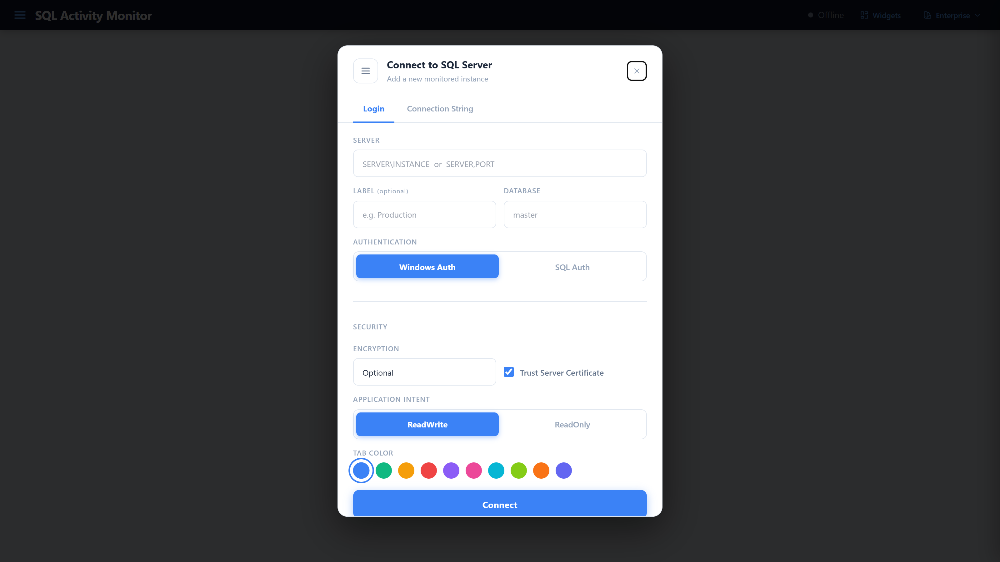

# SQL Server Activity Monitor

A live, web-based SQL Server Activity Monitor — built to replicate and extend SSMS Activity Monitor with animated rolling charts, real-time data tables, multi-server tabs, and a fully configurable widget layout.




---

## Features

### Live Metrics (2-second polling)
- **KPI Strip** — 6 cards with micro sparklines, 30-second trend delta, and WARN/CRITICAL badges
- **Rolling Charts** — CPU %, Waiting Tasks, Database I/O MB/s, Batch Requests/sec, Network I/O MB/s, SQL Compilations/sec — 2-minute animated history window

### Instance Monitoring
- **Memory Health** — committed vs. target memory, Page Life Expectancy, pending memory grants
- **Active Processes** — TOP 100 sessions: CPU, memory, elapsed time, wait type, blocking chain, query text
- **Resource Waits** — TOP 25 wait stats by category; 25 benign wait types filtered out
- **Current Waits** — real-time wait classification (locking, I/O, memory, parallelism, network)
- **Data File I/O** — per-file I/O stall breakdown with read/write split
- **Blocking Chains** — live blocker/blocked session pairs with query comparison
- **Deadlock History** — last 25 deadlocks parsed from XEvent ring buffer XML
- **SQL Error Log** — last 24 hours of error log entries

### Query Performance
- **Recent Expensive Queries** — last 1 hour, ranked by average elapsed time; CPU, logical reads, execution count
- **Active Expensive Queries** — TOP 50 currently running queries with wait type and elapsed time
- **sp_WhoIsActive** — expandable rows with full SQL text (requires `sp_WhoIsActive` to be installed)

### Capacity & Storage
- **Drive Space Monitor** — per-volume total/used/free cards, utilization bars, trend slope (%/hr), ETA-to-full forecast; four severity levels with per-drive-type thresholds
- **Database Sizes** — fill bars with low-disk alerts, colored by threshold
- **Database Size Trends** — daily size snapshots with 10-day rolling window; chart and table view

### Jobs & Maintenance
- **SQL Agent Jobs** — live job status, last run result, duration; filter/search/sort
- **Backup Health** — last backup age per database, status badge, ETA-to-critical
- **Index Health** — async background fragmentation scan with session recovery; unused index detection; health score gauge; paginated results with detail modal (disabled by default)

### UX
- **Multi-server Tabs** — connect to multiple SQL instances; per-connection metrics isolation; persistent connection history
- **Widget Sidebar** — toggle any of 24 widgets on/off; drag sections to reorder; layout persists to localStorage
- **10 Color Themes** — Enterprise (default), Dark, Midnight, Forest, Ocean, Rose, Slate, Mossy Hollow, Golden Taupe, Wisteria Bloom; runtime switching via CSS custom properties
- **Virtualized Tables** — TanStack React Virtual for smooth scrolling of 100+ row result sets
- **Connect Modal** — per-connection login or raw connection string; saved connection history

---

## Requirements

- Node.js 20 LTS
- SQL Server 2012 or later
- SQL login with `VIEW SERVER STATE` permission

---

## Quick Start

```bash
git clone https://github.com/ZiyadMehmoodDBA/SQL_activity_monitor.git
cd SQL_activity_monitor

cp .env.example .env
# Edit .env — set AUTH_TYPE, and DB_USER/DB_PASS if using SQL auth

npm install
npm start
```

Open [http://localhost:3000](http://localhost:3000) and click **Connect** to add your first SQL Server instance.

---

## Configuration

`.env` reference:

```env
# Server port (default: 3000)
PORT=3000

# Poll frequency in milliseconds (default: 2000)
POLL_INTERVAL_MS=2000

# "windows" = Windows Integrated Auth (no credentials needed)
# "sql"     = SQL Server login (requires DB_USER + DB_PASS)
AUTH_TYPE=windows

DB_USER=
DB_PASS=

# Enable kill-session endpoints — OFF by default, review before enabling
ALLOW_KILL=false
```

### Authentication

| `AUTH_TYPE` | Connection method |
|---|---|
| `windows` | Trusted connection via Tedious driver (Windows Integrated Auth) |
| `sql` | SQL Server login — requires `DB_USER` / `DB_PASS` |

Credentials can also be entered per-connection in the UI; `.env` values are server-process defaults only.

### SQL Permission

Minimum required on each monitored instance:

```sql
GRANT VIEW SERVER STATE TO [your_login];
```

All queries are read-only DMV queries. No schema changes, no stored procedures, no temp tables (except `sp_WhoIsActive` which is optional).

---

## Development

```bash
npm run dev            # Vite HMR dev server + Node backend (concurrently)
npm run build          # Production Vite build → dist/
npm start              # Serve built dist/ + Node backend

npm test               # Vitest watch mode
npm run test:run       # Single pass (CI)
npm run test:coverage  # Coverage report
```

---

## Drive Space Thresholds

Thresholds are applied per drive type based on free-space percentage. Drive type is auto-detected from SQL Server file assignments.

| Drive type | Warning | Critical | Emergency |
|---|---|---|---|
| System `C:\` | < 20% free | < 10% free | < 5% free |
| Data (SQL data files) | < 15% free | < 8% free | — |
| Log (transaction logs) | < 25% free | < 15% free | — |
| TempDB | < 25% free | < 15% free | — |

Color coding: green → orange → red → deep red.

Trend line: slope in %/hr + projected time until full, calculated from the last 60 seconds of readings.

---

## Monitored Metrics

| Metric | Source DMV(s) |
|---|---|
| CPU % | `sys.dm_os_ring_buffers` (XML parse) |
| Waiting Tasks | `sys.dm_exec_requests` |
| Database I/O MB/s | `sys.dm_io_virtual_file_stats` (delta) |
| Batch Requests/sec | `sys.dm_os_performance_counters` |
| Network I/O MB/s | `sys.dm_os_performance_counters` |
| SQL Compilations/sec | `sys.dm_os_performance_counters` |
| Memory (committed / target / PLE) | `sys.dm_os_performance_counters` |
| Drive Space (total / used / free / trend) | `sys.dm_os_volume_stats` + `sys.master_files` |
| Active Processes | `sys.dm_exec_sessions` + `sys.dm_exec_requests` + `sys.dm_exec_sql_text` |
| Resource Waits | `sys.dm_os_wait_stats` |
| Current Waits | `sys.dm_exec_requests` (grouped by wait_type) |
| Data File I/O | `sys.dm_io_virtual_file_stats` + `sys.master_files` |
| Recent Expensive Queries (1h) | `sys.dm_exec_query_stats` |
| Active Expensive Queries | `sys.dm_exec_requests` + `sys.dm_exec_sql_text` |
| Blocking Chains | `sys.dm_exec_requests` (blocking_session_id) |
| Deadlock History | `sys.dm_xe_session_ring_buffer_targets` (XEvent XML parse) |
| SQL Agent Jobs | `msdb.dbo.sysjobs` + `msdb.dbo.sysjobactivity` + `msdb.dbo.sysjobhistory` |
| Database Sizes | `sys.master_files` + `sys.dm_os_volume_stats` |
| Database Size Trends | Daily snapshots persisted to disk (10-day rolling) |
| Backup Health | `msdb.dbo.backupset` (last 60 days) |
| SQL Error Log | `sys.dm_os_ring_buffers` (RING_BUFFER_RESOURCE_MONITOR, 24h) |
| Index Fragmentation | `sys.dm_db_index_physical_stats` + `sys.dm_exec_query_stats` |
| sp_WhoIsActive | `sp_WhoIsActive` (optional, must be pre-installed) |

---

## Architecture

See [ARCHITECTURE.md](ARCHITECTURE.md) for full documentation.

### Data Flow

```
SQL Server DMVs
    └─► server.js poll loop (every 2s, Promise.all parallel queries)
            └─► Socket.io emit 'metrics' → room per connId
                    └─► useSocket hook → dispatch UPDATE_METRICS
                            └─► AppContext reducer → history ring buffer
                                    └─► Dashboard → KPIBar, Charts, Tables
```

### Project Structure

```
├── server.js                   # Express + Socket.io backend (polling, REST API)
├── server/
│   ├── indexScanOrchestrator.js  # Async index health scan with progress tracking
│   ├── indexScanStore.js         # In-memory scan result cache
│   ├── indexScanQueries.js       # Index fragmentation SQL queries
│   ├── repository/               # Data access layer
│   └── scanners/                 # Index scanning logic
├── src/
│   ├── App.jsx                   # Shell: header, tabs, connect modal, widget sidebar
│   ├── main.jsx                  # Vite entry point
│   ├── index.css                 # Design tokens (CSS custom properties)
│   ├── context/
│   │   └── AppContext.jsx        # Global state (useReducer), localStorage persistence
│   ├── hooks/
│   │   └── useSocket.js          # Socket.io lifecycle, auto-reconnect
│   ├── lib/
│   │   ├── widgetRegistry.js     # Widget manifest and layout persistence
│   │   ├── thresholds.js         # WARN/CRIT thresholds, status color logic
│   │   ├── palettes.js           # Named color themes, CSS var injection
│   │   ├── fmt.js                # Number, byte, and duration formatters
│   │   └── tableCols.js          # Column definitions for all data tables
│   └── components/               # 20+ React components (charts, tables, panels)
├── ARCHITECTURE.md               # Full architecture documentation
├── .env.example                  # Environment variable template
└── vite.config.js                # Build configuration
```

---

## License

MIT
